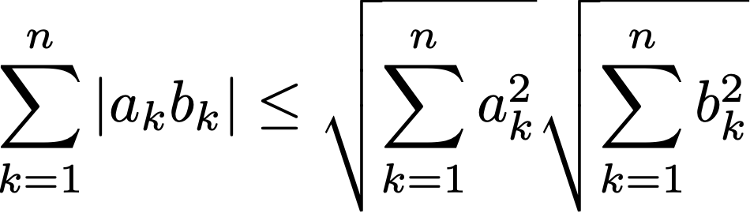

# Documents Maths & Python en MPSI 1 - Aux Lazaristes

## Révisions pour le concours blanc.

C'est parti pour la période de révision. Il y aura chaque jour des exercices dont le corrigé sera disponible le lendemain matin. Les exercices sont dans les cours correspondants disponibles sur ce site sous Maths/Cours/Revisions. Les solutions sont disponibles petit à petit sous Maths/Cours/Revisions/CorrigeExercices.

* Lundi 24 février : Nombres complexes
    * Exemple après la proposition 11 (somme des z_k / 2^k...)
    * Les 4 exemples avant la définition 9 (module et argument de 1+z+z^2...)
    * Les 2 derniers exemples du cours (27(z-1)^6... et cos(pi/7)...)
* Mardi 25 février : Révisions d'algèbre
    * Les 4 exemples avant 2.2.2, qui commencent par le calcul de tan(pi/12) (lire les remarques précédentes).
    * Les 2 équations avant la proposition 23
    * Les inéquations avant la proposition 24
    * Les 2 derniers systèmes du cours
* Mercredi 26 février : Fonctions usuelles
    * Exemple après la proposition 23
    * Exemple après la proposition 24
    * Exemple après la proposition 31
    * Exemple après la proposition 
* Jeudi 27 février : Révisions analyse
    * Le cours est disponible  dans Maths/Cours/Revisions
    * Exemples sur la monotonie avant "le 2) Limites"
    * Exemples de techniques de calcul au 2.3. Attention, il est strictement interdit d'utiliser le symbole "lim" et on veillera toujours à factoriser par la partie principale.
    * Exemple avant la proposition 15
    * Exemple avant la partie 5.3)
* Vendredi 28 février : Réels  
    Pour la suite, nous allons utiliser les exercices d'Alain Troesch. http://alain.troesch.free.fr . Cliquez sur "Exercices" dans la colonne de gauche et téléchargez le polycopié des exercices. On commence donc avec les réels, chapitre 6, page 23.
    * Exercice 6.2
    * Exercice 6.11
    * Exercice 6.18. On demande de prouver l'inégalité de Cauchy-Schwartz.
      |  |
      | :--: | 
    * Exercice 6.26
* Lundi 2 mars : Suites
    * Exercice 12.5
    * Exercice 12.22
    * Exercice 12.31
* Mardi 3 mars : Continuité, dérivation
    * Exercice 16.4
    * Exercice 16.17
    * Exercice 16.28
    * Exercice 16.31
* Mercredi 4 mars : Polynômes
    * Exercice 22.2
    * Exercice 22.8
    * Exercice 22.9
    * Exercice 22.23
* Jeudi 5 mars : Fractions rationnelles
* Vendredi 6 mars : Espaces vectoriels

## Le discours de la semaine.

Le discours de Steve Jobs pour la remise des diplômes de Stanford en 2005. Steve Jobs est bien connu pour son champ de distorsion de la réalité et il faut toujours prendre ce qu'il dit avec beaucoup de distance. Par exemple il n'a jamais créé Pixar mais a fortement investi dans cette société dix ans après sa création. Ce discours est intéressant, car on voit comment l'intérêt de Jobs pour la typographie a influencé la création des premiers Macintosh, une façon de montrer qu'il ne faut jamais oublier ce qui nous rend singuliers. Il met aussi en valeur quelque chose d'important : un échec contient toujours quelque chose de positif dont il faut savoir tirer parti.

Un rumeur a circulé selon laquelle la "pomme croquée" choisie par Steve Jobs était une référence à Alan Turing, le mathématicien qui a théorisé l'ordinateur en 1936 (la machine de Turing) et construit le premier "ordinateur" pour casser le codage Allemand durant la seconde guerre mondiale. Voici un court résumé de sa vie. Vous pouvez lire le livre de Philippe Langenieux-Villard, intitulé "La pomme d'Alan Turing", pour en savoir plus.

---

## Emploi du temps de la semaine du concours blanc (prévision)

* Lundi 9 mars
    *  8h00 - 12h00: Devoir de Français
    * 13h45 - 15h45: Cours de Physique 
    * 15h45 - 18h45: Devoir de LV1
* Mardi 10 mars
    *  8h00 - 10h00: Devoir de Chimie
    * 10h00 - 12h00: Cours de Physique
    * 13h45 - 15h45: Cours de SI / Cours d'option info
    * 15h45 - 17h45: Cours de Maths
* Mercredi 11 mars
    *  8h00 - 10h00: TP de SI / Cours de LV1
    * 10h00 - 12h00: Cours de Mathématiques
    * 13h45 - 16h45: Cours de Mathématiques
* Jeudi 12 mars
    *  8h00 - 10h00: Cours de Mathématiques
    * 10h00 - 12h00: Cours de Physique
    * 13h45 - 15h45: Cours de Chimie
    * 15h45 - 17h45: Cours d'Anglais
* Vendredi 13 mars
    *  8h00 - 12h00: Devoir de Maths
    * 13h45 - 16h45: Devoir d'option
* Samedi 14 mars:
    *  7h45 - 11h45: Devoir de Physique

## Prévisions de l'avancement du cours de maths sur la prochaine période

* Semaine du 9 au 14 mars : Dimension finie / Intégration
* Semaine du 16 au 20 mars : Intégration
* Semaine du 23 au 27 mars : Développements limités
* Semaine du 30 mars au 3 avril : Matrices
* Semaine du 6 au 10 avril : Matrices / Pivot de Gauss
* Semaine du 14 au 17 avril : Groupe symétrique / Déterminants

---

## Prévisions de l'avancement du cours de maths sur la période mai/juin

* Semaine du 4 au 7 mai : Déterminants / Géométrie affine
* Semaine du 11 au 15 mai : Euclidiens
* Semaine du 18 au 20 mai : Euclidiens
* Semaine du 25 au 29 mai : Séries numériques
* Semaine du 1 au 5 juin : Dénombrement
* Semaine du 8 au 12 juin : Probabilités
* Semaine du 15 au 19 juin : Variables aléatoires
* Semaine du 22 au 24 juin : Concours blanc
